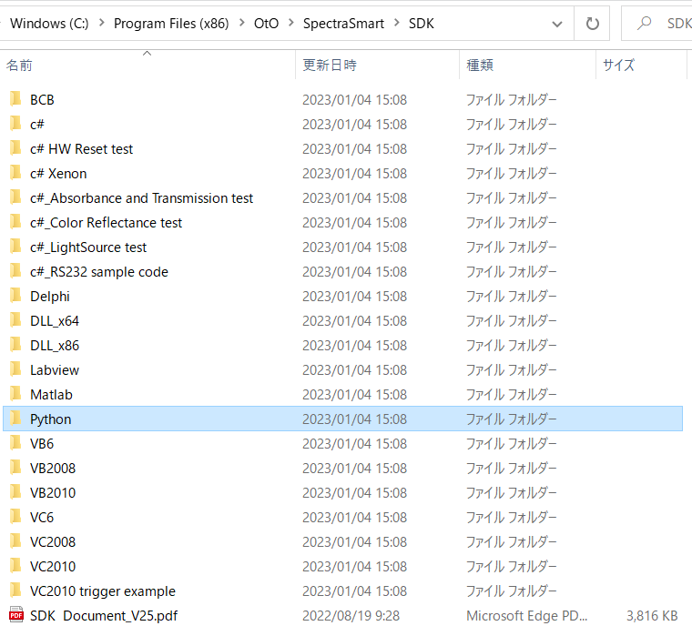
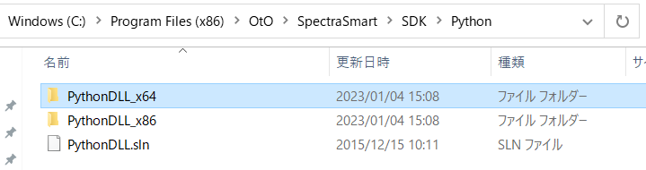
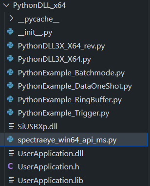
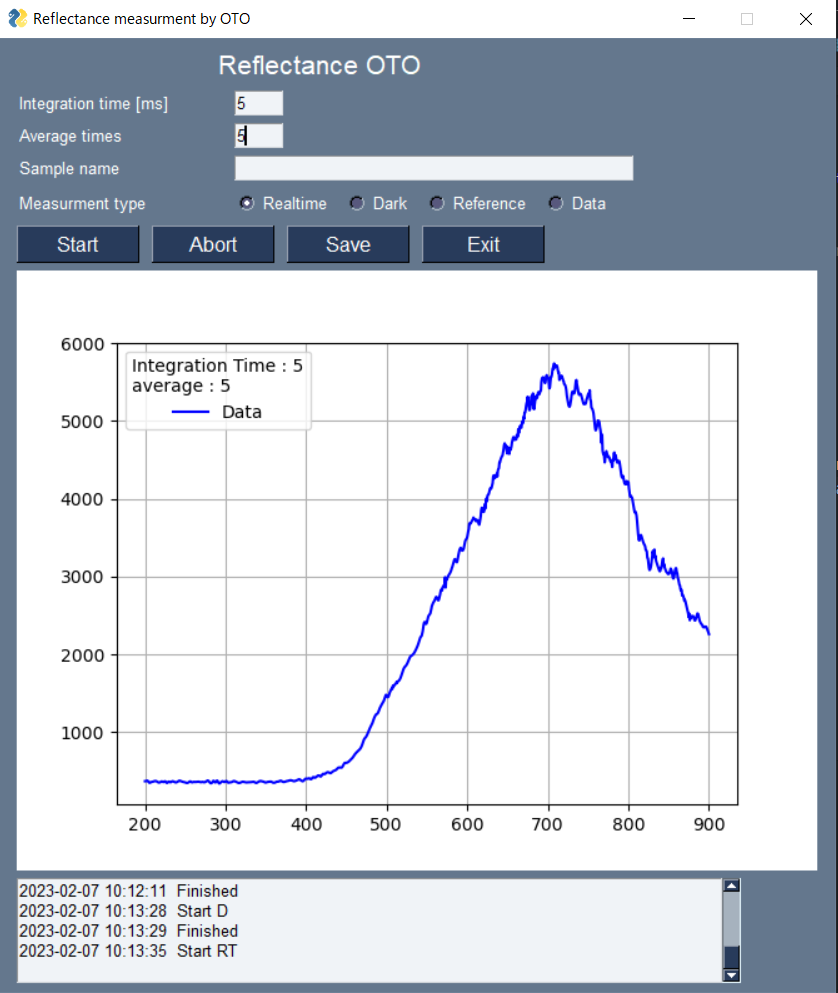
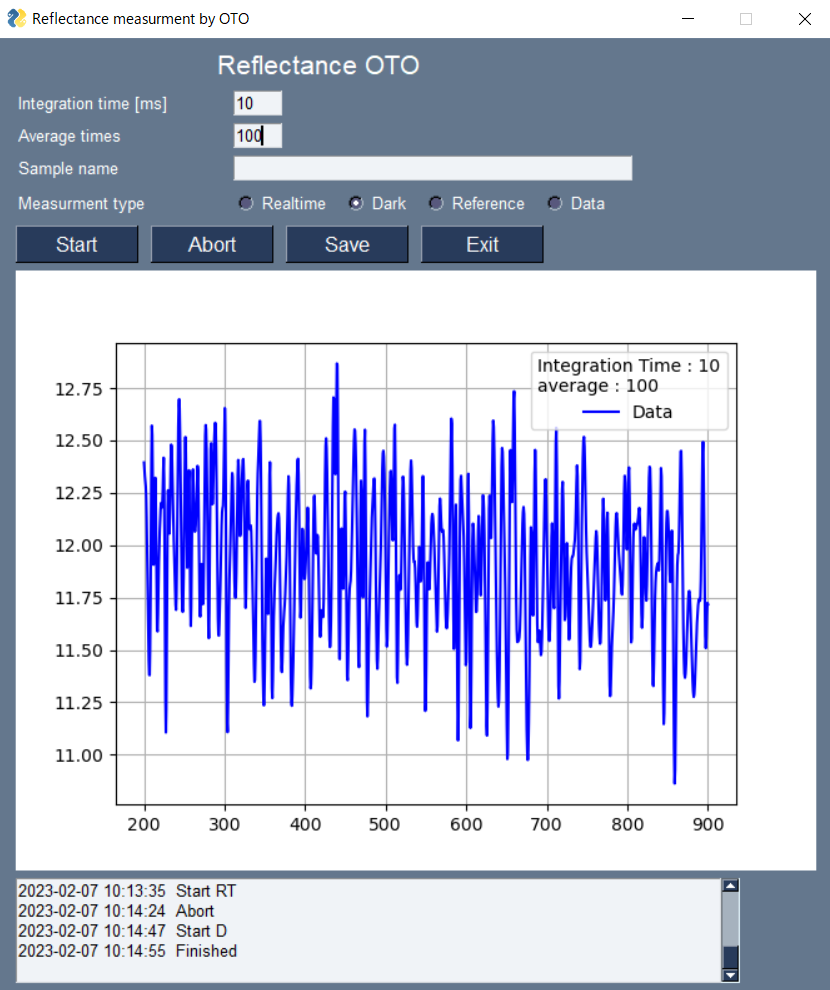
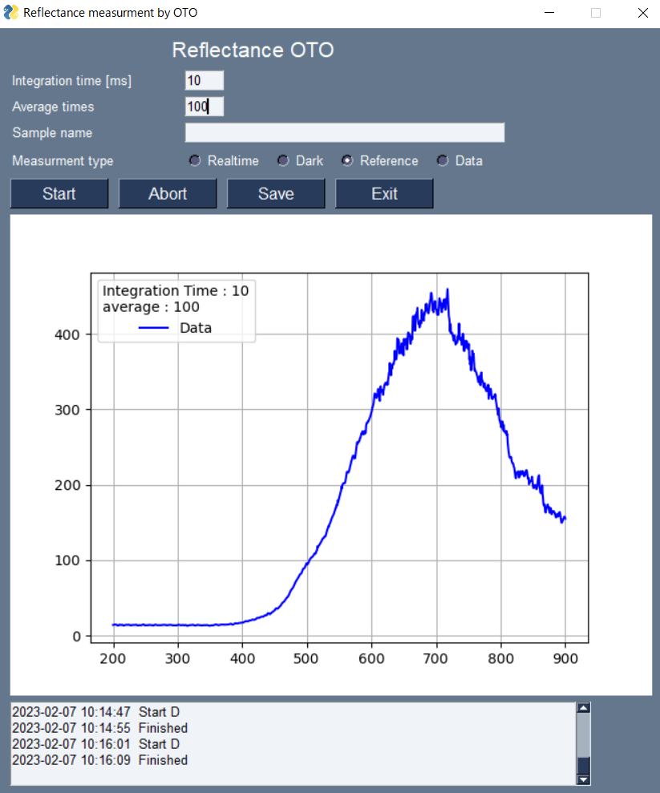
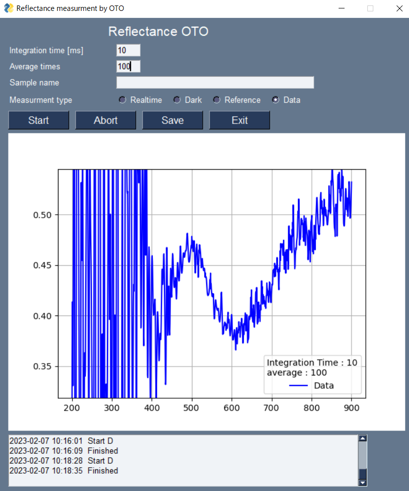
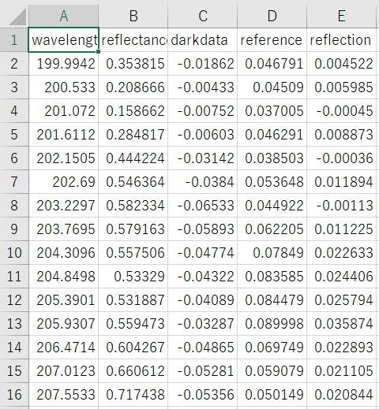

## OTOによる反射測定アプリケーション

OTOの分光器を用いて光学測定を行うPythonプログラム

PysimpleGUIを用いてGUIを作成

OTOから配布されているPython SDK内のプログラムを参考に作成


#### 環境

##### PCとPython

Windows 10 Pro　64bit

ANACONDA

Python=3.9, 

numpy,  matplotlib, pandas, pysimpleGUI


##### 光学系

Techno synergy社の広帯域ファイバーコリメータ、2分岐ファイバー

[膜厚測定システム DF1045RT｜テクノシナジー (techno-synergy.co.jp)](http://www.techno-synergy.co.jp/nkd_products/DF1045RT.html)

OTO分光器

[超小型分光モジュール：：：サンインスツルメント株式会社 (sun-ins.com)](http://www.sun-ins.com/lineup5/oto/)


#### プログラム

プログラムは２つの部品から作成されています。

（1）分光器の設定と測定（dllの呼び出し）をまとめたクラスのプログラム

（2）このクラスを用いて反射測定用GUIプログラム


#### インストールと設定

- OTOから配布されているSpectraSmartにあるsetup.exeを実行しデバイスをインストール
- Program Files/OTO/SpectraSmart/SDKにPythonフォルダーがあることを確認。　64bit版を利用するのでPythonDLL_x64を利用します。





- PythonDLL_x64フォルダーに作成した、”spectraeye_win64_api_ms.py”と”__init__.py”を入れる。(このリポジトリにはdllは入っていません。OtOから配布のソフトでインストールしてください。）

 

- PythonDLL.slnと同じ階層に”gui_graph_multi_oto.py”のプログラムを入れる。


####　利用方法

- コマンドプロンプトまたはパワーシェルを用いて PythonDLL.slnと同じ階層のディレクトリーに移動する　(cdコマンドを用いる)
- 移動したらプログラムを実行する
```powershell
python gui_graph_multi_oto.py
```


####　反射測定プログラム

Integration time、Average times、measurment typeを選んでStratを押すと測定が始まる。Abortで測定をキャンセルすることができる。

- Realtimeは連続測定モードである。光学調整などを行うために用いる
- Darkは光源がファイバーに入らないようにしてバックグラウンドの測定を行う。
- ReferenceはSiやAlなどを用いて参照スペクトルの測定を行う。
- Dataは測定対象物の測定を行う。グラフには反射率が表示される。（Dataの取得前にDark、Referenceの測定を行っていると実際の反射率が表示される。測定していない場合、Dark=0、Reference=1として計算された値が表示される。）
- Dark、Referenceは再測定しない限り、最後に測定した値が保存されている。
- Saveを押すと測定データがCSV形式でこのプログラムのあるディレクトリーにあるデータフォルダーに格納される。また、グラフがPNG形式で保存される。

#####　Realtimeの測定




##### Darkの測定




##### Referenceの測定




##### Dataの測定




##### DataをSaveした時のCSVファイル


